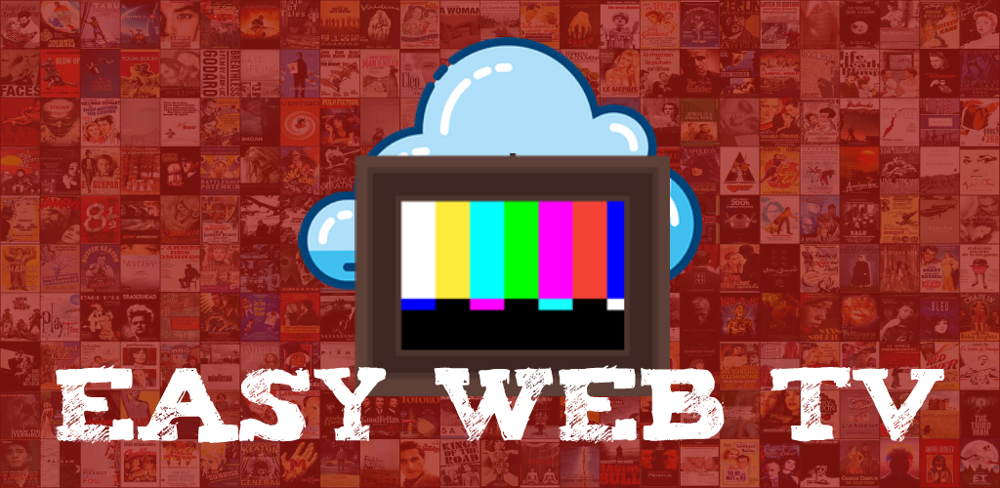
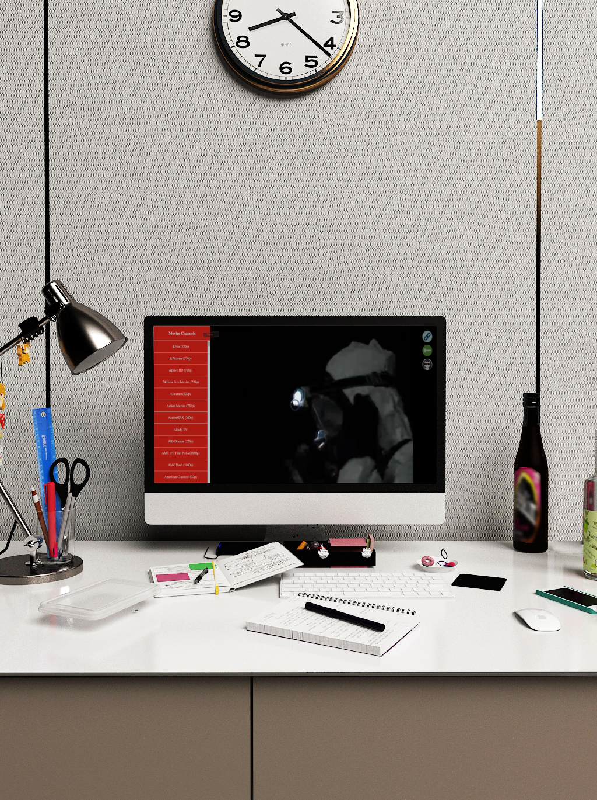

# Easy-Web-TV-M3u8

[](https://github.com/zhangboheng/Easy-Web-TV-M3u8/issues)
[](https://github.com/zhangboheng/Easy-Web-TV-M3u8/network/members)
[](https://github.com/zhangboheng/Easy-Web-TV-M3u8/stargazers)
[](https://github.com/zhangboheng/Easy-Web-TV-M3u8/blob/main/LICENSE)
[](https://github.com/zhangboheng/Easy-Web-TV-M3u8)

An all-in-one web entertainment platform to watch TV, movies, series, anime, shows, listen to music and radio, read novels and manga, and play games - all in one place.

## 📋 Table of Contents

- [Demo](#-demo)
- [Features](#-features)
- [Screenshots](#-screenshots)
- [Tech Stack](#-tech-stack)
- [Getting Started](#-getting-started)
- [Project Structure](#-project-structure)
- [Contributing](#-contributing)
- [Sponsor](#-sponsor)
- [Thanks](#-thanks)
- [License](#-license)

## 🎬 Demo

**[Live Demo](https://zhangboheng.github.io/Easy-Web-TV-M3u8/)**

## ✨ Features

### 📺 TV & IPTV
- Watch 6000+ TV channels from around the world
- Filter by country, language, and category
- Support for M3U8 video links
- Favorite channels for quick access

### 🎬 Movies & Series
- Search and watch movies, series, animes, and shows
- Multiple source options
- Favorites and watch history

### 🎵 Music & Radio
- Search and listen to music
- Browse and play podcasts with cover art and titles
- Podcast episode list with search and playback controls
- Access 28000+ radio stations worldwide
- Radio station search by name, country, language
- Favorites system for music and podcast episodes

### 📖 Reading
- Search and read novels/books
- Search and read manga
- Reading progress tracking
- Chapter navigation

### 🎮 Games
- Built-in mini games (Square Obstacles, Pong, Breakout, Tic Tac Toe)
- **Emulator support** - Play retro console games, powered by [EmulatorJS](https://emulatorjs.org/)
  - **Nintendo**: NES, SNES, N64, GB/GBC, GBA, NDS
  - **PlayStation**: PS1/PSX
  - **Sega**: Genesis/Mega Drive, Master System, Game Gear, Sega CD, Sega 32X, Saturn
  - **Atari**: 2600, 5200, 7800, Jaguar, Lynx
  - **Commodore**: C64, C128, VIC-20, PET, Plus/4, Amiga
  - **Other**: 3DO, Arcade (FBNeo, MAME 2003), ColecoVision, Virtual Boy
- **5300+ preset ROMs** across 6 platforms, with search on the game launcher
  - NES (805), SNES (772), GB/GBC (800), GBA (992), N64 (116), Genesis (1841)
  - Arcade preset is currently empty - bring your own or load from a URL
- **Three ways to load a ROM**: pick from the preset list, upload a file (core auto-detected by extension), or paste a ROM URL
- Gamepad support
- Save/load states and fullscreen via the in-emulator controls
- Reset button to return to the ROM selection screen
- 🎮 **How to play with a gamepad on TV:**
  1. Access the app through the browser on your TV
  2. Select an emulator to enter
  3. Plug in the gamepad before the game starts

### 🔧 Other Features
- 🌐 Multi-language support
- ⭐ Favorites system for all content types
- 🔍 Powerful search functionality
- 📱 Responsive design for mobile devices
- 🎨 Modern dark theme UI
- 🔒 Sensitive content filter (adult content)

## 📸 Screenshots

### Homepage



### TV


### Movie


### Radio


### Novel


### Manga


### Music & Podcast


### Game


## 🛠️ Tech Stack

- **Frontend**: HTML5, CSS3, JavaScript (ES6+)
- **Library**: jQuery 3.6.0
- **Video Player**: Video.js
- **Image Viewer**: Spotlight.js
- **Emulator**: EmulatorJS (RetroArch-based)
- **APIs**:
  - [iptv-org](https://github.com/iptv-org/iptv) - TV channels
  - [Radiobrowser](https://github.com/segler-alex/radiobrowser-api-rust) - Radio stations

## 🎮 Emulator Features

### Dynamic ROM Loading
- **JSON-based ROM catalogue**: ROM lists are stored in separate JSON files for easy maintenance
- **Platform-specific loading**: Each platform (NES, GBA, SNES, GB, N64) has its own JSON file
- **Caching system**: Loaded ROM lists are cached for faster switching
- **Search filter**: Filter ROMs by name in real-time

### Supported Platforms
| Platform | Core | Games | JSON File |
|----------|------|-------|----------|
| NES | fceumm | 805 | nes.json |
| GBA | mgba | 992 | gba.json |
| SNES | snes9x | 772 | snes.json |
| GB | gambatte | 800 | gb.json |
| N64 | mupen64plus_next | 116 | n64.json |
| **Total** | - | **3485** | - |

### Core Features
- **Automatic core detection**: Upload any ROM file and the system automatically detects the platform
- **URL parameter support**: Direct link to specific platform (e.g., `?core=snes9x`)
- **No core selection UI**: Simplified interface with automatic detection
- **Error handling**: Comprehensive error handling with user-friendly messages
- **CORS proxy support**: Multiple proxy servers for ROM loading

## 🚀 Getting Started
n

### Prerequisites

- A modern web browser (Chrome, Firefox, Safari, Edge)
- Internet connection

### Installation

1. Clone the repository:
   ```bash
   git clone https://github.com/zhangboheng/Easy-Web-TV-M3u8.git
   ```

2. Navigate to the project directory:
   ```bash
   cd Easy-Web-TV-M3u8
   ```

3. Open `index.html` in your browser or use a local server:
   ```bash
   # Using Python
   python -m http.server 8000
   
   # Using Node.js
   npx serve
   ```

4. Open `http://localhost:8000` in your browser

## 📁 Project Structure

```
Easy-Web-TV-M3u8/
├── index.html              # Main entry point
├── manifest.json           # PWA manifest
├── sw.js                   # Service worker
├── css/
│   ├── main.css           # Main styles
│   ├── style.css          # Additional styles
│   └── emulatorjs.css     # Emulator-specific styles
├── js/
│   ├── index.js           # Main JavaScript
│   ├── catalogues.js      # Catalogue functions
│   ├── translator.js      # Translation handler
│   ├── emulatorjs.js      # Emulator logic & ROM loading
│   ├── togame.js          # Game launcher & emulator picker
│   ├── music.js           # Music player logic
│   ├── podcast.js         # Podcast player with favorites
│   ├── tomusic.js         # Music page navigation & podcast browsing
│   └── ...                # Other modules
├── data/
│   └── roms/              # ROM catalogue files
│       ├── nes.json       # 805 NES games
│       ├── snes.json      # 772 SNES games
│       ├── gb.json        # 800 GB/GBC games
│       ├── gba.json       # 992 GBA games
│       ├── n64.json       # 116 N64 games
│       ├── genesis.json   # 1841 Genesis games
│       └── arcade.json    # Arcade (FBNeo) presets (currently empty)
├── routes/
│   ├── tv.html            # TV page
│   ├── movie.html         # Movie page
│   ├── music.html         # Music page
│   ├── radio.html         # Radio page
│   ├── novel.html         # Novel page
│   ├── manga.html         # Manga page
│   ├── game.html          # Game page
│   ├── emulatorjs.html    # Emulator pages
│   └── ...                # Other pages
├── catalogues/
│   └── *play.html         # Player pages
├── gamebox/
│   └── ...                # Mini games
└── images/
    └── ...                # Image assets
```

## 🤝 Contributing

Contributions are welcome! Please feel free to submit a Pull Request.

1. Fork the repository
2. Create your feature branch (`git checkout -b feature/AmazingFeature`)
3. Commit your changes (`git commit -m 'Add some AmazingFeature'`)
4. Push to the branch (`git push origin feature/AmazingFeature`)
5. Open a Pull Request

## ☕ Sponsor

[](https://www.buymeacoffee.com/zhangboheng)

If you like this project, consider buying me a coffee! ☕

## 🙏 Thanks

This project uses the following open source projects:

- [jQuery](https://github.com/jquery/jquery) - JavaScript library
- [iptv-org](https://github.com/iptv-org/iptv) - IPTV channels database
- [Radiobrowser](https://github.com/segler-alex/radiobrowser-api-rust) - Radio stations API
- [Video.js](https://github.com/videojs/video.js) - Video player
- [Spotlight.js](https://github.com/nextapps-de/spotlight) - Image viewer
- [EmulatorJS](https://github.com/EmulatorJS/EmulatorJS) - RetroArch-based emulator
- [Font Awesome](https://fontawesome.com/) - Icons

## Star History

<a href="https://www.star-history.com/?repos=zhangboheng%2FEasy-Web-TV-M3u8&type=date&legend=top-left">
 <picture>
   <source media="(prefers-color-scheme: dark)" srcset="https://api.star-history.com/chart?repos=zhangboheng/Easy-Web-TV-M3u8&type=date&theme=dark&legend=top-left" />
   <source media="(prefers-color-scheme: light)" srcset="https://api.star-history.com/chart?repos=zhangboheng/Easy-Web-TV-M3u8&type=date&legend=top-left" />
   
 </picture>
</a>

## 📄 License

This project is licensed under the GNU Affero General Public License v3.0 - see the [LICENSE](LICENSE) file for details.

Permissions of this weak copyleft license are conditioned on making available source code of licensed files and modifications of those files under the same license. Copyright and license notices must be preserved. Contributors provide an express grant of patent rights.

---

Made with ❤️ by [Zhang Boheng](https://github.com/zhangboheng)
